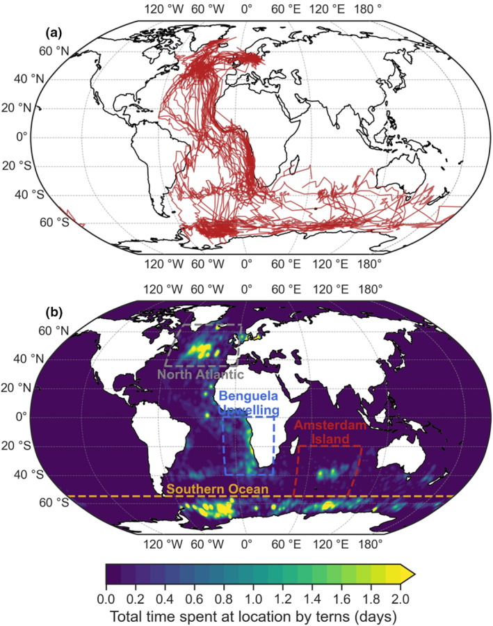

# Arctic Tern Migration 

|  |  |
|:--:|:--:|
| *Arctic Tern (Sterna paradisaea)* | *Migration Route and Time Spent (Morten et al. 2023)* |

Arctic terns (Sterna paradisaea) are small seabirds known for having the longest migration of any animal on earth. Every year, these ambitious birds travel from their arctic breeding grounds (places like Greenland, Iceland, and Northern Canada) all the way down to the Antarctic coast. This equates to a round trip of 43,000 miles!

Because of this migration pattern, Artic terns experience more daylight than any species on the planet, living in continuous summer. How nice.

These birds are slender, have long pointed wings, and a forked tail. Their shape allows them to be efficient, and agile fliers. Adults have a black cap on their head, and a brightly colored orange and red beak. The majority of their feathers are white and grey.

Arctic terns are social birds, they spend their time in colonies with other terns. They nest in costal areas, where they lay 1-3 eggs on bare ground. Arctic terns feed on small fish and marine invertebrates.

## GBIF Data Migration Map 

The data used from GBIF are occurances, pared with coordinates and date and time. This data is sourced from museums, government agencies, research institutions, and citizen science platforms.  

This map of Arctic tern migration using Global Biodiversity Information Facility (GBIF) Occurrence data. You can observe the normaized distrabution of Arctic terns over space and time. The map uses data from 2024. 

[View Interactive Migration Map](https://KaiSkowlund.github.io/migration_portfolio_post/arctic_tern_occurrences_dashboard2.html)

## Climate Change Implications 

Arctic tern migration paths, and their overall behavior are highly dictated by their environmental conditions, and resource availability. Current climate models for the furture indicate a shift in many of these factors.
    
- Shifting Food Hotspots
  - Terns time their long migratory journey with ocean productivity. (upwellings/polar fronts) in order to maximize avalability of fish and zooplankton.
  - Recent modeling (Morten et al. 2023) indicates a decline in primary productivity in the North Atlantic.
  - If those areas of high productivity shift, turns will need to adjust their migration path or foraging behavor to compensate for the high energy expendature durring their migration.
 
- Sea Ice Loss In Antarctic
  - When the terns are not breading they will use sea ice as a resting and feeding platform.
  - Reduction in sea ice could result in reduction of safe resting habitat.
  - Makes the southern part of their migration more risky
 
- Changing Wind Conditions
  - The migration routes of Arctic terns are dictated by wind conditions, that allow them to glide long distances.
  - Climate models suggest minor wind changes along their route
  - Souther Ocean westerlies are predicted to shift and force route adjustment, or higher energy expendature.
 
These birds are at risk because of climate change, but fortunatly for them, they are a resiliant species. They are adapatble flyers, but they are not invincable. Reducing climate change impacts are the only sure way to ensure long term survival. 

### Sources:

Morten JM, Buchanan PJ, Egevang C, Glissenaar IA, Maxwell SM, Parr N, Screen JA, Vigfúsdóttir F, Vogt-Vincent NS, Williams DA, Williams NC, Witt MJ, Hawkes LA, Thurston W. Global warming and arctic terns: Estimating climate change impacts on the world's longest migration. Glob Chang Biol. 2023 Oct;29(19):5596-5614. doi: 10.1111/gcb.16891. Epub 2023 Jul 26. PMID: 37492997; PMCID: PMC10946559.

Global Biodiversity Information Facility. (2025). Occurrence data for Sterna paradisaea (Version 2025-07-08) [Data set]. https://doi.org/10.15468/dl.hcbfxy (Downloaded October 20th, 2025) 

C. Egevang,I.J. Stenhouse,R.A. Phillips,A. Petersen,J.W. Fox, & J.R.D. Silk,  Tracking of Arctic terns Sterna paradisaea reveals longest animal migration, Proc. Natl. Acad. Sci. U.S.A. 107 (5) 2078-2081, https://doi.org/10.1073/pnas.0909493107 (2010).

